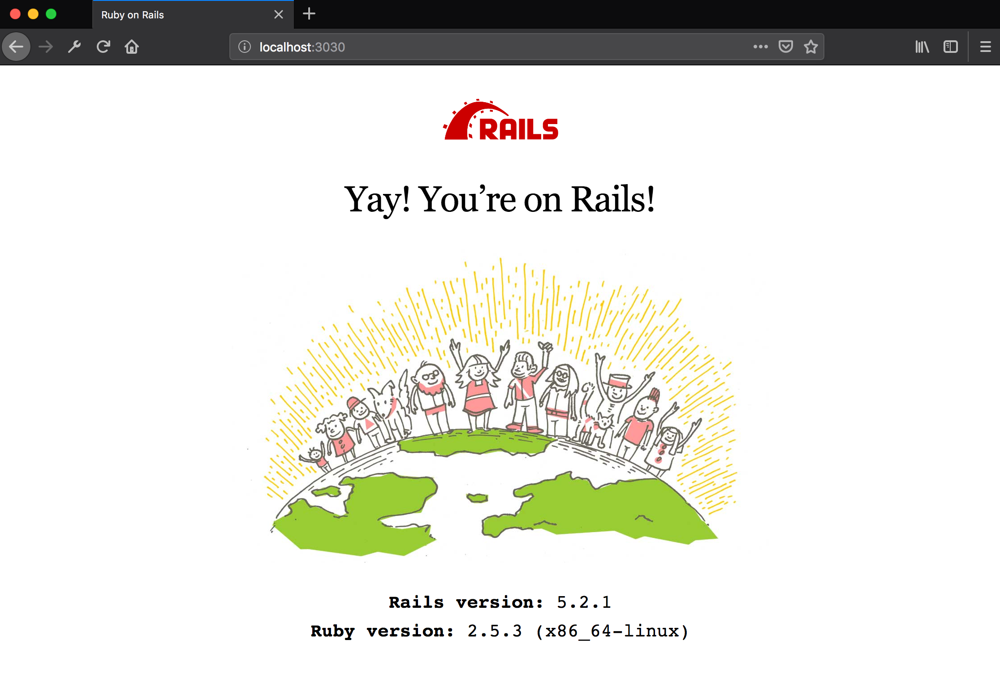

<<<<<<< HEAD
# Coding Environment Installation Guide

These instructions will setup a system that can be used as a development environment.  When this process is finished, you will be able to run and work on projects using Ruby on Rails and PostgreSQL.

When this setup is finished, you will be able to preview a Ruby on Rails web application within a web browser that will look like the following.

## Select Your Operating System to Install

* [Windows](windows.md)
* [Apple Macintosh](mac.md)

# TODO

* Regenerate the zip file.
* https://workspace.thefirehoseproject.com/comments/48 — linked to
* Vagrant setup.  Explicitly say "This [env] will be refered to as 'coding environment'"
* Windows explicit error - https://workspace.thefirehoseproject.com/comments/45
* Vagrant cheat sheets, https://online.bootcampspot.com/cheat-sheets/vagrant-windows, are configured for `coding-environment`.
* show steps about needing to allow vagrant (David's screenshot)

# flixter
=======
# README

This README would normally document whatever steps are necessary to get the
application up and running.

Things you may want to cover:

* Ruby version

* System dependencies

* Configuration

* Database creation

* Database initialization

* How to run the test suite

* Services (job queues, cache servers, search engines, etc.)

* Deployment instructions

* ...
>>>>>>> 07075c216df9dadbd4f9540f4b69b6a80eae8b76
